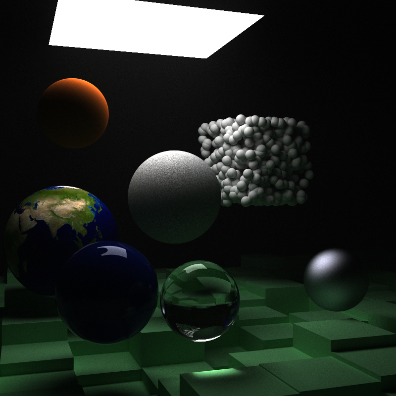
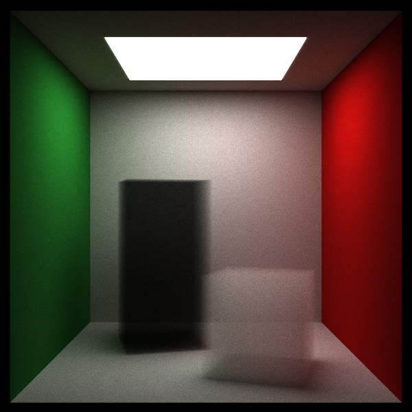
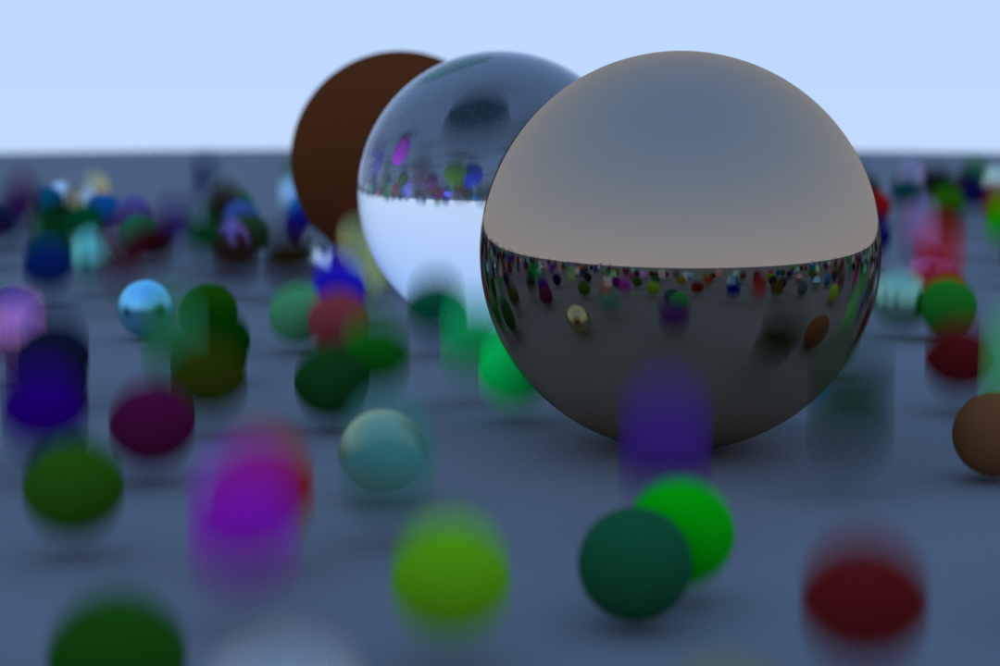

# Ray Tracing in One Weekend, In Rust

# Features

* Materials
  * Lambertians
  * Dialectrics
  * Metals
  * Extensible Material trait representation.
  * Isotropic
* Textures
  * Image textures
  * Procedural textures
  * Extensible Texture trait representation.
* Geometry
  * Constant density convex mediums
  * Implicit surfaces (e.g. spheres, rectangles)
  * Motion Blur
* Performance
  * BVH (Bounding Volume Hierarchy) implementation for fast ray collisions.
  * Multi-threaded, tiled rendering
* Camera
  * Depth of Field
  * Shutter Speed

# Usage

For more details on how to use this crate, run `cargo doc --open` in the folder.

The binary provides a command line interface to rendering sample scenes. To install, while in the folder, use `cargo install --path .`. Then use `shimmer --help` for more informtion. Or, skip installation and run `cargo run -- --help`.

# Sample Renders

*Constant Density Mediums*

*Motion blur*

# Acknowledgements

This repository is based on Peter Shirley's book [_Ray Tracing in One Weekend_](https://raytracing.github.io/books/RayTracingInOneWeekend.html).
